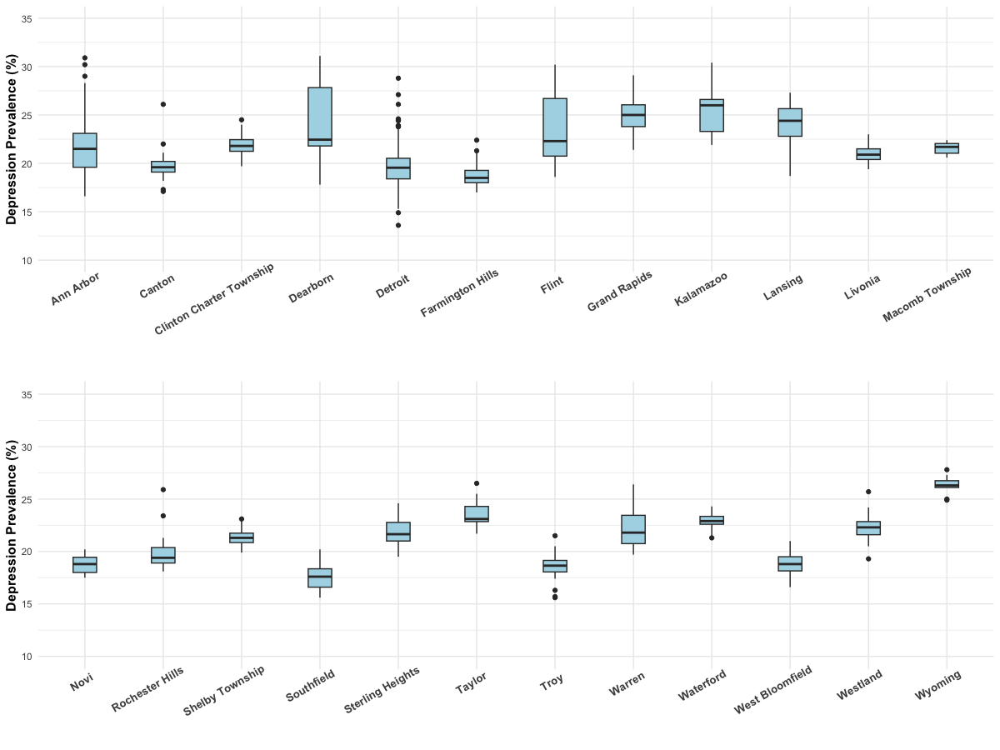
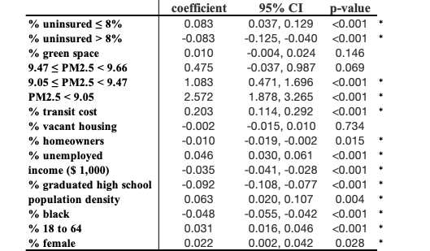

# Depression Prevalence Analyses and Modeling

This folder documents our analysis of **depression prevalence** across Michigan cities using indicators from the MI-HealthyCity project. We here summarize the indicators, demographic measures, visualization, and the **piecewise spatial linear model** that quantifies associations between depression prevalence and social/environmental determinants while adjusting for demographics.

> For an overview of the MI-HealthyCity project, see the [Github](https://github.com/YanlinTong/MI-HealthyCity/blob/main/README.md) and the [UMich SPH webpage](https://sph.umich.edu/ideas/mi-healthycity-tool.html).

---

## Indicators & Demographics

- **Indicators:** 9 indicators spanning 6 domains, including:
  - Uninsured rate (%)
  - Green space proportion (%)
  - PM2.5 concentration (µg/m³)
  - Transit cost proportion (%)
  - Vacant housing rate (%)
  - Homeownership proportion (%)
  - Unemployment rate (%)
  - Income ($1,000)
  - High school graduate proportion (%)

- **Demographics:**
  - Population density
  - Black population proportion (%)
  - Population aged 18 to 64 proportion (%)
  - Female population proportion (%)

- **Outcome:** depression prevalence (%).

---

## Methods

1. **Spatial visualization**
   - We mapped the geographic distribution of selected indicators via <a href="https://yanlintong.github.io/MI-HealthyCity/html/1_Depression.html" target="_blank">interactive heatmaps</a> to contextualize spatial patterns across MI census tracts.

2. **City-level summaries**
   - For depression prevalence, we use **boxplots** to display the distribution across 24 MI cities.

3. **Piecewise spatial linear regression**
   - We built a **piecewise spatial linear regression** that accounts for cross-city spatial dependence.
   - **Uninsured rate breakpoint:** Visual inspection of partial effects suggested a slope change around **8%**; we therefore used **8%** as the **piecewise knot** (two linear segments: \<8% and ≥8%).

---

## Results

### Boxplot of depression prevalence (%) by city
Each box shows the **IQR** for city-specific depression prevalence across tracts; the **horizontal line** denotes the median; **dots** are outliers (>1.5×IQR beyond Q3 or below Q1); **whiskers** extend to the most extreme non-outlier values.

  - **Highest median**: **Wyoming** (≈26.3%), indicating the greatest overall burden of depression prevalence.  
  - **Lowest median**: **Southfield** (≈17.6%), indicating the lowest central tendency of depression prevalence .
  - **Largest IQR:** **Dearborn** (≈6.0%), indicating substantial variability within the city.
  - **Smallest IQR:** **Wyoming** (≈0.7%), indicating tighter clustering around the median.

### Piecewise spatial linear model results

  - **< 8% uninsured:** +1% uninsured → **+0.083%** depression prevalence.  
  - **≥ 8% uninsured:** +1% uninsured → **−0.083%** depression prevalence.  
  - **PM2.5 (9.05–9.47 μg/m³):** **+1.083%** higher depression prevalence compared to tracts with PM2.5 > 9.66 μg/m³.  
  - **PM2.5 (< 9.05 μg/m³):** **+2.572%** higher depression prevalence compared to tracts with PM2.5 > 9.66 μg/m³.  
  - **Transportation cost proportion:** +1% → **+0.203%** depression prevalence.  
  - **Homeownership rate:** +1% → **−0.010%** depression prevalence.  
  - **Unemployment rate:** +1% → **+0.046%** depression prevalence.  
  - **Median household income:** +$1,000 → **−0.035%** depression prevalence.  
  - **High school graduates:** +1% → **−0.092%** depression prevalence.
  
---

